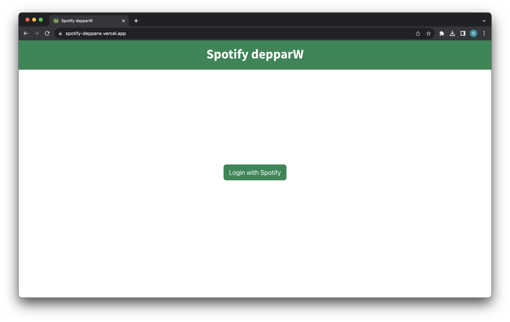
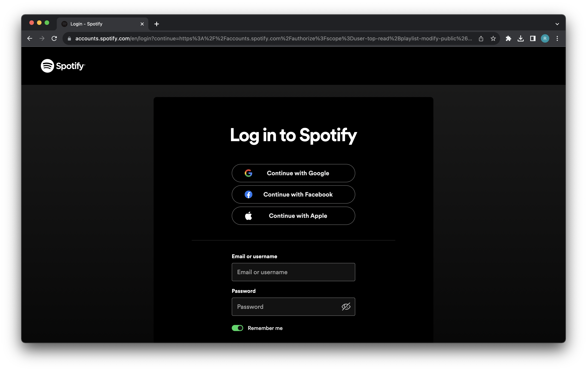
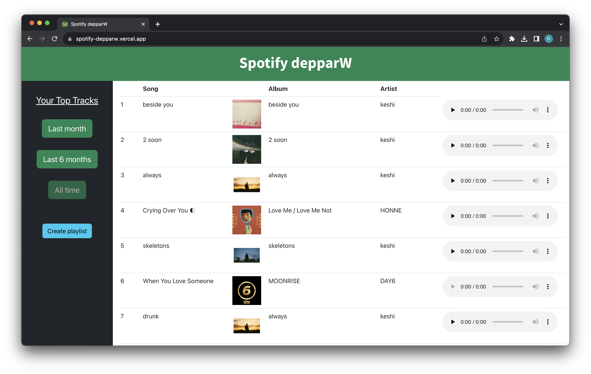

# Getting Started with Spotify Depparw

Spotify Depparw allows a user to view their most played songs in three different time ranges (past month, past 6 months, all time). It uses Spotify's OAuth to authenticate the user and interacts with Spotify's API to display song information. 

## Deployed Website URL

https://spotify-depparw.vercel.app/

Unfortunately, due to limitations with the Spotify API, the deployed site does not work without reaching out to me. There are provided steps below to host the app locally and to receive your own Spotify API permissions. 

Here are some screenshots of the working app.

### Landing Page

### Login Page

### Dashboard

